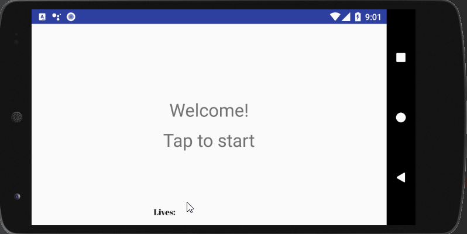

# Reflex Game

## Overview

This is a simple Android game. The objective of the game is to tap the circle spots on the screen before they disappear.  You start with 5 lives and the game ends when you lose all of them.

## Download

This app is not available on Google play (maybe after some enhancements!). For now, you may download [the apk](./readme/app-debug.apk) and install it on your Android phone via usb.  Alternatively, you can clone the repo and use Android Studio to run the app on your Android phone. 

## Development

I developed this app using only Android SDK and Java. I did not use any game engines or external libraries. I did this because I was very curious about the real difficulties of game development. In the end, I found the experience very rewarding. Here are some of the challenges I faced.

* Architecture: from the beginning I wanted to design the app in a way that separated game logic from the view logic. I believed that I would likely want to change the layout of the app later on and I would not want to break the game while doing so.  With this purpose, I divided the majority of logic for the game in three classes: 1) Game - a classes representing the state of the game, 2) GameRunner - the class performing all of the game logic and 3) GameView - an interface describing all that was required of the view layer; the interface was implemented by my Activity.
* Parallel processing: I implemented this app such that the game logic runs in a secondary thread.  Implementing this was hard.  I wanted a dedicated thread to which I could submit my game logic as a runnable.  The game runnable needs to be notified to finish running (and return) when the game is over, yet I wanted the thread to persist and simply wait for the game to restart. I could not achieve the effect I wanted using standard ExecutorServices and Looper/Handler Threads, however What I designed looks a little like a looper thread.  
* Animations and collision detection: working with Android's animators is not that intuitive, but the real challenge here was to code the spots' movements such that they would bounce from the walls. A typical game engine might do this using collision detection, but I thought that was an overkill for this game. What I set out to do was instead to figure out the trajectory of each spot at the moment of its creation and figure out when and how it should bounce from the borders of the layout. I then created an Android ObjectAnimator for each spot that contained the bouncing informaion. I do not remember how I coded this, but I am proud of myself. The result is a game that is not hard on your phone battery. 

## Future enhancements

I had bigger dreams for this game. It's easy to see it becoming the new Flappy Bird.  But I think I have already implemented what I initially set out to implement and it is time to move on. I will likely add the ability to share the highscores on social media at some point and release the game... idk..

# Thanks!